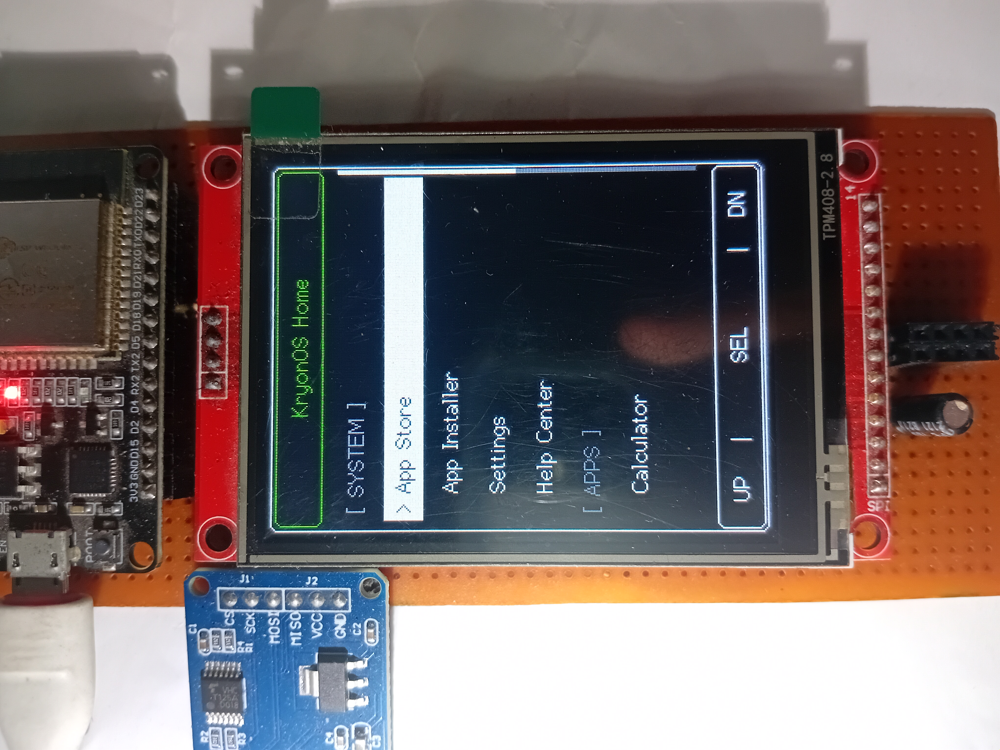

# KryonOS

KryonOS is an **open-source**, lightweight, high-performance **GUI** Operating System and JavaScript App Runtime designed specifically for the ESP32 microcontroller. It provides a complete desktop-like experience on embedded devices, featuring an integrated JS engine (Duktape) for executing standalone JavaScript applications, double-buffered graphics for smooth 2D/3D rendering, an App Store, file management, and direct hardware API access.



## Features

* **JavaScript App Runtime:** Execute interactive JS apps natively on the ESP32 using the optimized Duktape engine.
* **Rich UI & Graphics:** Built-in graphics library with double-buffering support for smooth, tear-free 2D and 3D rendering.
* **App Store & Installer:** Browse, download, and install JavaScript apps and updates dynamically over Wi-Fi.
* **File Management:** Fully functional file explorer and text editor utilizing the SD Card for storage.
* **Hardware API:** Easy-to-use JavaScript APIs for controlling GPIO, reading touch input, accessing the SD card, and reading sensors.
* **Multitasking Feel:** Launch, suspend, and switch between utility apps, games, and hardware monitors.

## Hardware Needed

* **ESP32 Development Boards** (Supported: ESP32 WROOM-32, ESP32-S2, ESP32-S3, ESP32-C3)
* **ILI9341 2.8" TFT Display** (SPI interface with XPT2046 Touch Controller)
* **MicroSD Card Module** (SPI interface)
* **Breadboard & Jumper Wires**

## Pin Connections

The display and SD card use separate SPI buses on KryonOS. The display and touch pinout matches the **ESP32 Marauder** (v4, v6, and v6.1) hardware out-of-the-box. Below is the pin configuration:

| ESP32 Pin | ILI9341 TFT | SD Card Module | Notes |
| :--- | :--- | :--- | :--- |
| **GPIO 23** | MOSI | - | TFT SPI MOSI |
| **GPIO 19** | MISO | - | TFT SPI MISO |
| **GPIO 18** | SCK / CLK | - | TFT SPI Clock |
| **GPIO 17** | CS | - | TFT Chip Select |
| **GPIO 16** | DC / RS | - | TFT Data/Command |
| **GPIO 5**  | RST | - | TFT Reset |
| **GPIO 21** | T_CS | - | Touch Chip Select |
| **GPIO 13** | - | MOSI | SD SPI MOSI |
| **GPIO 26** | - | MISO | SD SPI MISO |
| **GPIO 14** | - | SCK / CLK | SD SPI Clock |
| **GPIO 15** | - | CS | SD Card Chip Select |
| **3V3**     | VCC / LED | VCC | 3.3V Power |
| **GND**     | GND | GND | Ground |

*(Note: If your specific board uses a different pinout, you can modify the display pins in your `platformio.ini` and the SD pins in `FileSystem.cpp`).*


## How to Flash

### Option 1: Using Precompiled Binaries
You can download the latest precompiled firmware `.bin` files directly from our [Releases Page](https://github.com/Haris16-code/KryonOS/releases). 

Use an ESP32 flasher tool (like `esptool.py` or the official ESP Flash Download Tool) to write the binaries to the correct sectors:
```bash
esptool.py --chip esp32 --port COM3 --baud 921600 write_flash -z \
  0x1000 bootloader.bin \
  0x8000 partitions.bin \
  0x10000 firmware.bin
```

### Option 2: Build it Yourself
To build and flash the firmware from source using PlatformIO:
1. Download the repository as a ZIP or clone it via git.
2. Open the project folder in your terminal or IDE (like VS Code).
3. Build and upload using the PlatformIO command:
```bash
pio run -t upload
```

## Documentation & Community

* [App Development Guide](./Documentation/App_Development_Guide.md) - Learn how to build and structure JavaScript applications for KryonOS.
* [JavaScript API Guide](./Documentation/JS_API_Guide.md) - Learn how to access system hardware using KryonOS's JS API.
* [KryonOS Wiki](https://github.com/Haris16-code/KryonOS/wiki) - Official wiki for detailed guides, tutorials, and system architecture.
* [Discussions](https://github.com/Haris16-code/KryonOS/discussions) - Join the community, ask questions, and share your ideas.

## Roadmap

* **Expanded Board Support:** Future updates will bring support for a wider variety of microcontrollers and ESP32 variants.
* **More Hardware APIs:** Continuous expansion of the JavaScript API to expose more low-level hardware features (e.g., Bluetooth, I2C, SPI sensors, advanced PWM, and deep sleep).

## License

KryonOS is licensed under the [GNU General Public License v3.0](./LICENSE).
